<h1>API SIMPLES </h1>
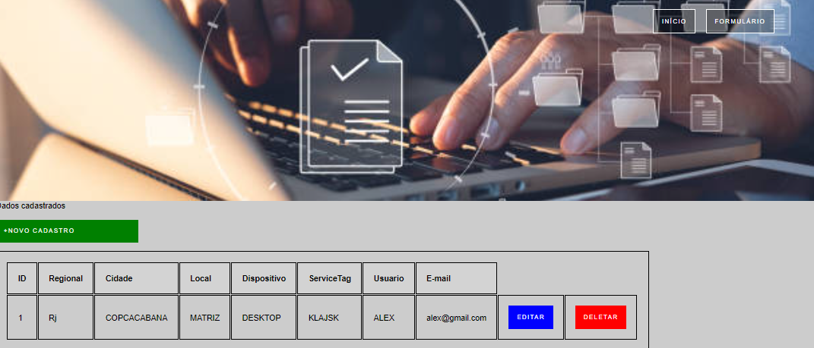

# Indice

- [Sobre](#-sobre)
- [Tecnologia Utilizada](#-tecnologia-utilizada)
- [Como baixar o projeto](#-como-baixar-o-projeto)

## Sobre

O projeto **Inventário básico** é para ser utilizado na gestão 
dos equimentos de TI.

## Tecnologia utilizadas

O projeto foi desenvolvido utilizando as seguintes tecnologias

- [Python](https://www.python.org/)
- [Flask](https://flask.palletsprojects.com/en/2.3.x/)
- [HTML](https://www.w3schools.com/html/default.asp)
- [CSS](https://www.w3schools.com/css/default.asp)
- [JAVASCRIPT](https://www.w3schools.com/js/)
- [SQLITE](https://www.sqlite.org/index.html)
- [SWAGGER](https://swagger.io/)

## Como baixar o projeto

#### Clonar repositorio

$ git clone https://

#### Entrar no diretório

$ cd inventario

#### Instalar as dependências

- $ pip install flask
- $ pip install db-sqlite3
- $ pip install render_template
- $ pip install request
- $ pip install redirect
- $ pip install url_for
- $ pip install  flash

# Desenvolvimento:

- Criar uma pasta em qualquer local do desktop
- Abrir a software de desenvolvimento (Pycharm ou VSCODE)
- importar as extensões (flask, render_template, request, redirect, url_for, flas, sqlite3)
- Link para conexão no banco de dados
- Rota para adicionar
- Rota para editar
- Rota para deletar
## Index python criado

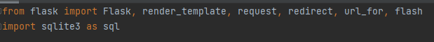
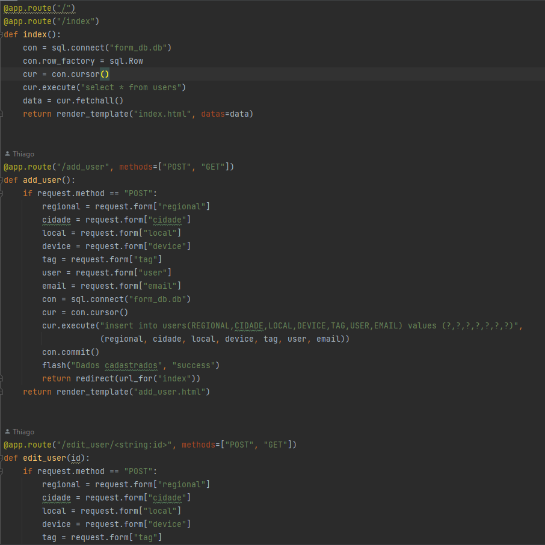
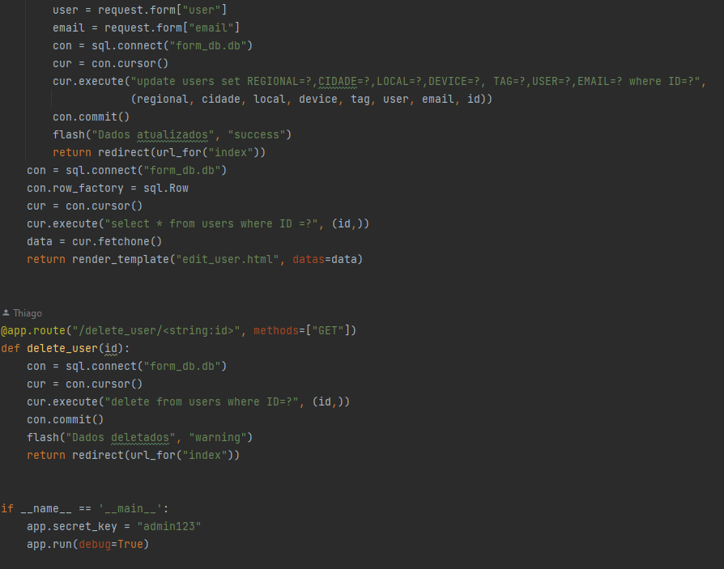

# Desenvolvendo banco de dados:

- Será necessário importar o sqlite3
- Criar o banco de dados

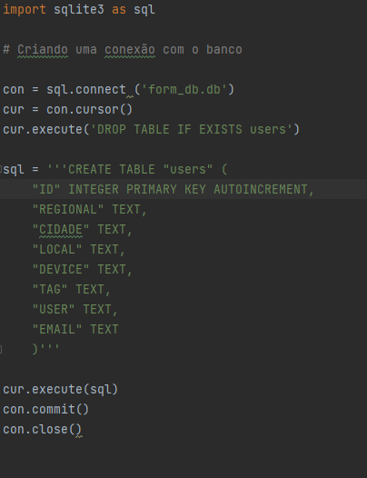

# Desenvolvendo HTML

- Desenvolvendo a home page
- Desenvolvendo index
- Desenvolvendo adicionar
- Desenvolvendo editar 

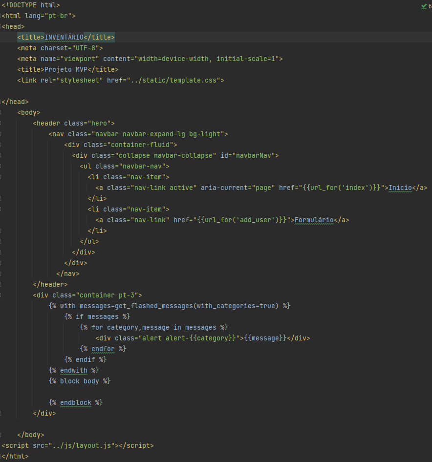
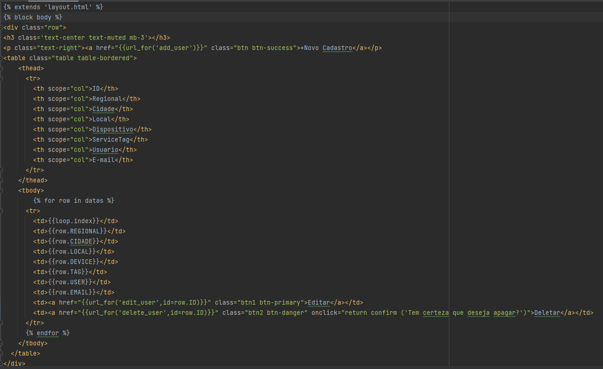
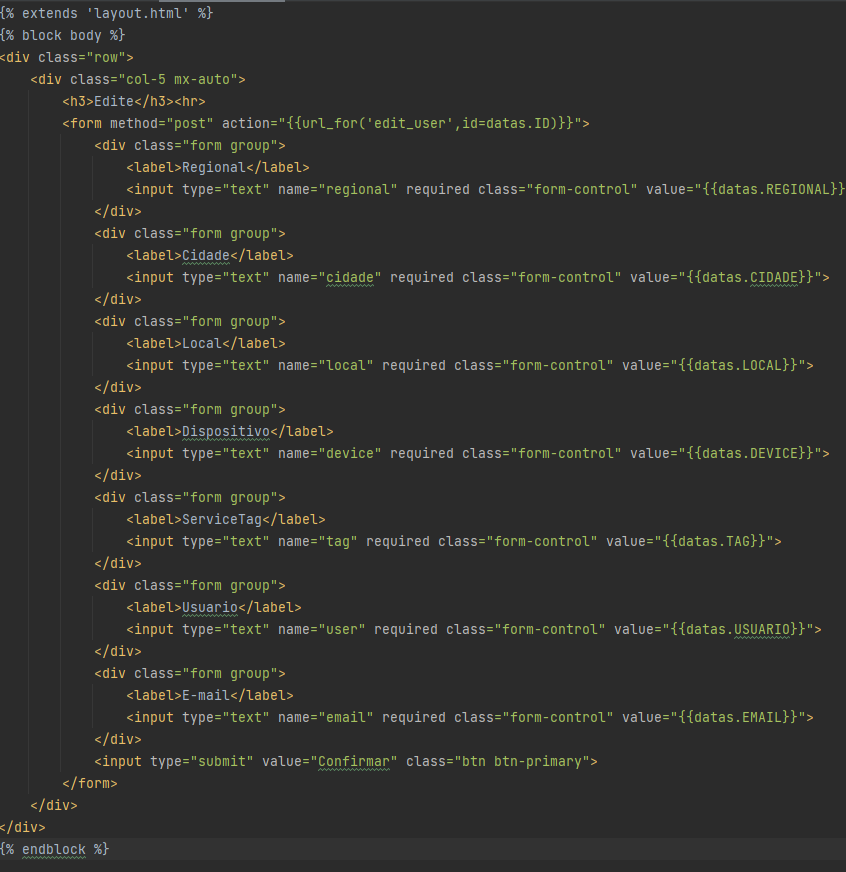
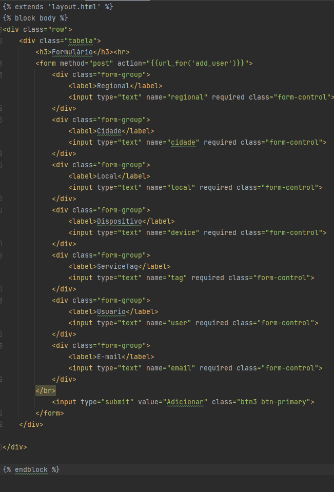

# Desenvolvendo CSS

- Desenvolvendo CSS das paginas html

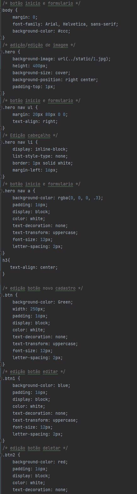
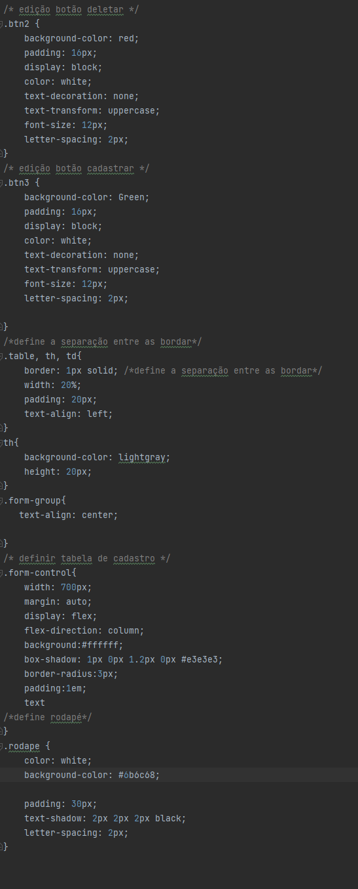

Desenvolvido por Thiago Luís.

[def]: ead1.pn